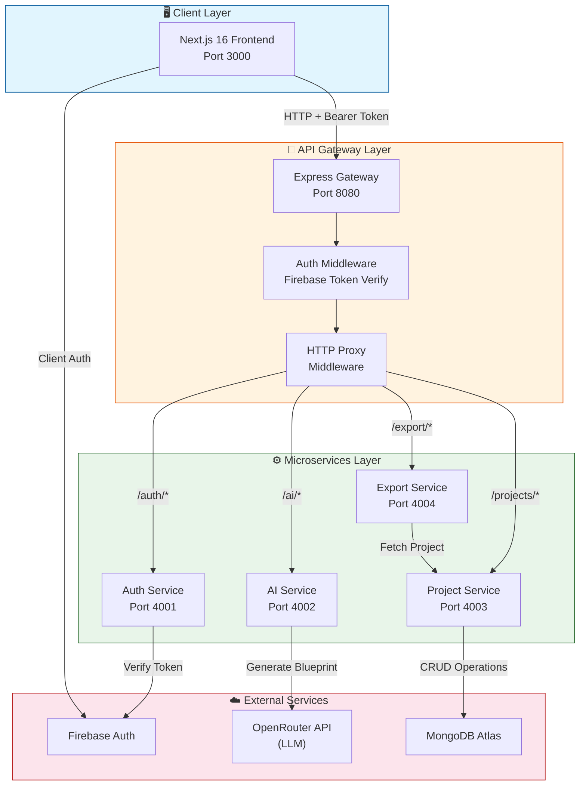
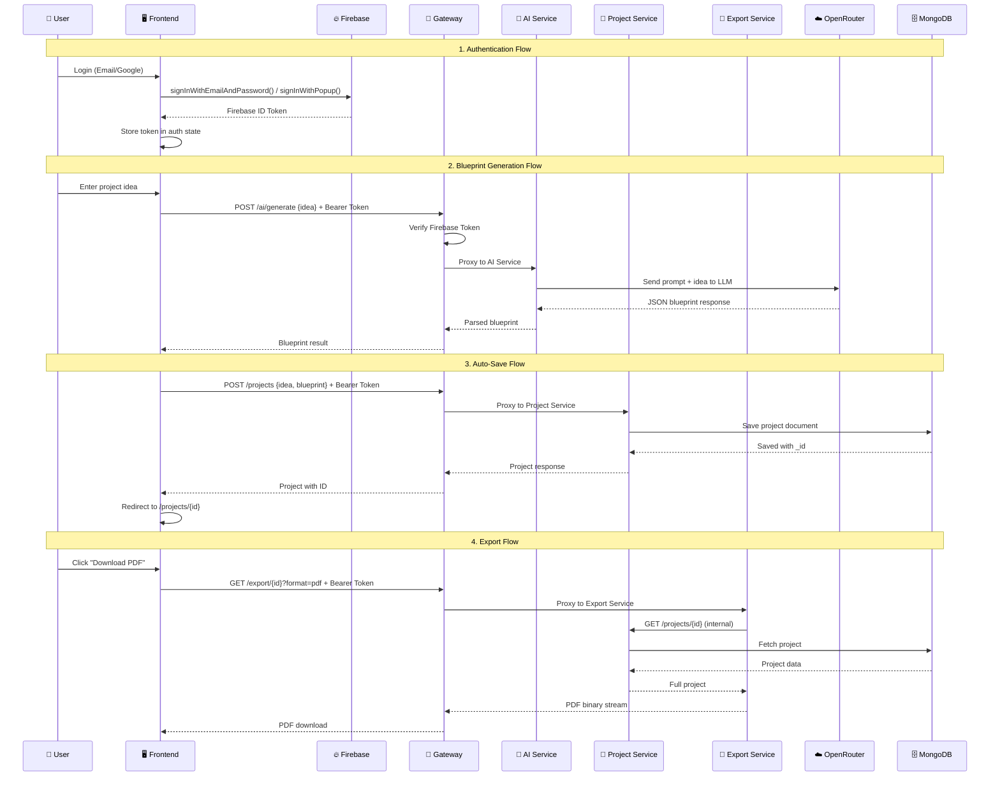
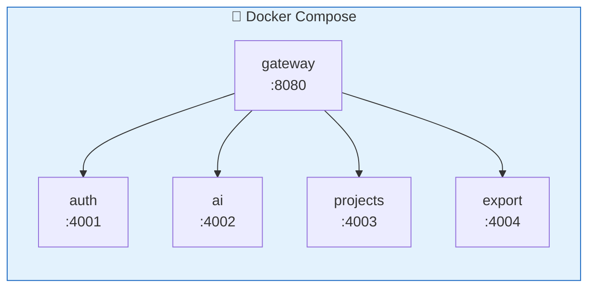
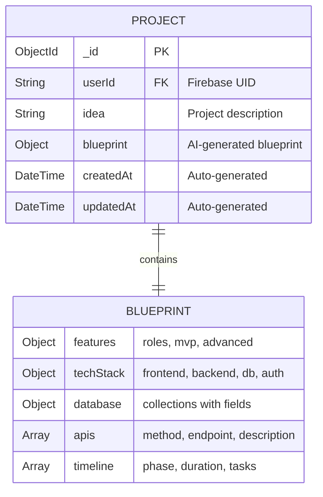
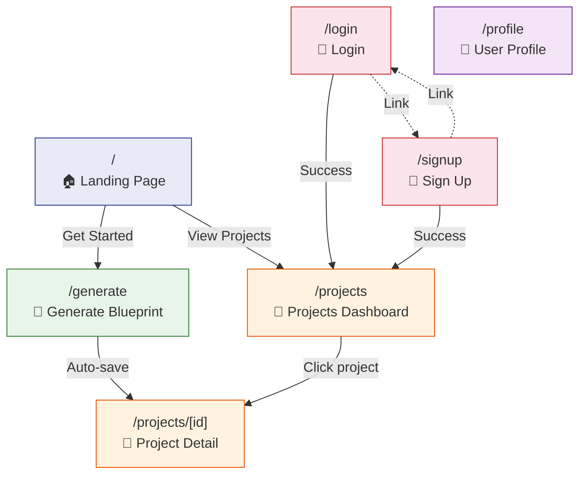
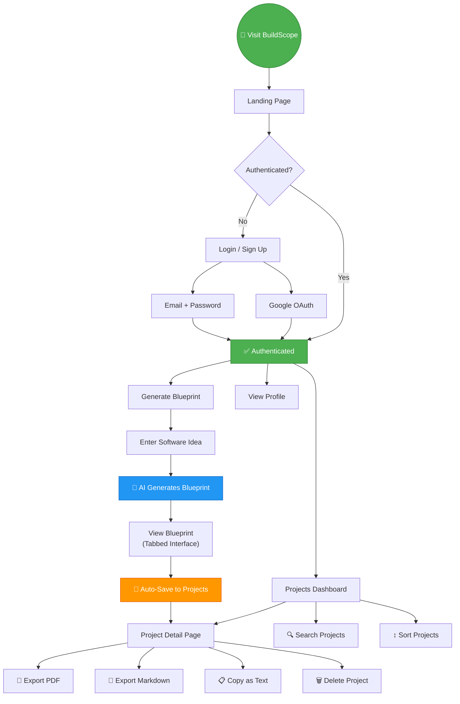
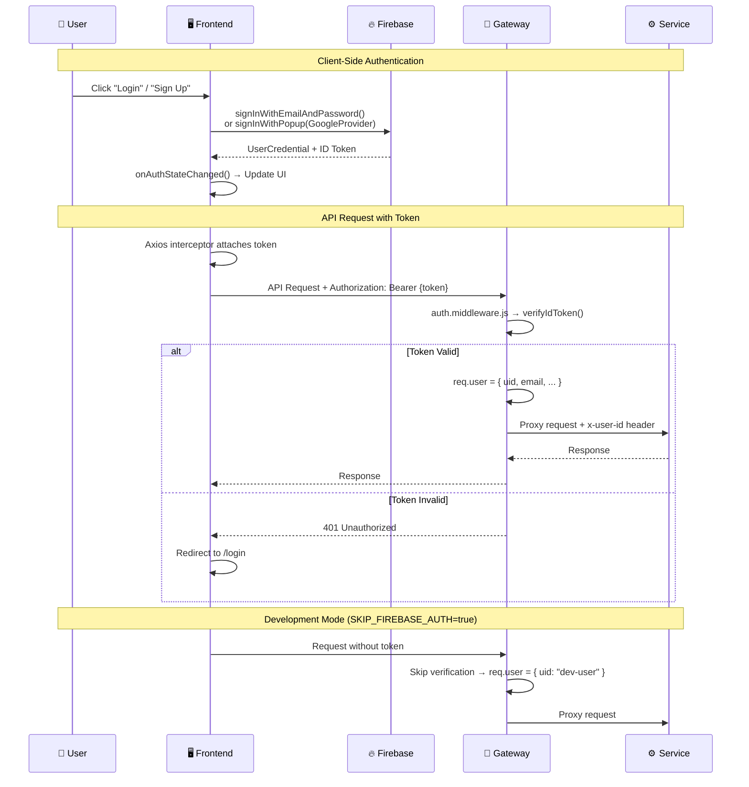
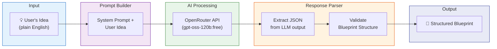

<p align="center">
  
</p>

<h1 align="center">🏗️ BuildScope</h1>

<p align="center">
  <strong>Transform plain-English software ideas into complete, structured project blueprints — powered by AI.</strong>
</p>

<p align="center">
  <a href="https://github.com/Shanidhya01/BuildScope"></a>
  
  
  
  
  
</p>

---

## 📖 Table of Contents

- [Overview](#-overview)
- [Features](#-features)
- [Architecture](#-architecture)
- [System Architecture Diagram](#-system-architecture-diagram)
- [Service Communication Flow](#-service-communication-flow)
- [Tech Stack](#-tech-stack)
- [Project Structure](#-project-structure)
- [Getting Started](#-getting-started)
  - [Prerequisites](#prerequisites)
  - [Environment Variables](#environment-variables)
  - [Running with Docker Compose](#running-with-docker-compose)
  - [Running Locally (Without Docker)](#running-locally-without-docker)
- [API Reference](#-api-reference)
- [Database Schema](#-database-schema)
- [Frontend Pages](#-frontend-pages)
- [User Flow Diagram](#-user-flow-diagram)
- [Authentication Flow](#-authentication-flow)
- [Blueprint Generation Pipeline](#-blueprint-generation-pipeline)
- [Deployment](#-deployment)
- [Contributing](#-contributing)
- [License](#-license)
- [Author](#-author)

---

## 🌟 Overview

**BuildScope** is an AI-powered microservices platform that converts natural language software ideas into comprehensive project blueprints. Simply describe your app idea in plain English, and BuildScope generates:

- ✅ Feature breakdowns (MVP + Advanced)
- ✅ Tech stack recommendations
- ✅ Database schema designs
- ✅ API endpoint specifications
- ✅ Development timelines
- ✅ System architecture plans

All blueprints can be saved, managed, and exported as **PDF** or **Markdown** documents.

---

## ✨ Features

| Feature | Description |
|---------|-------------|
| 🤖 **AI Blueprint Generation** | Describe your idea → get a full project blueprint powered by LLM (OpenRouter API) |
| 🔐 **Firebase Authentication** | Email/password + Google OAuth login/signup |
| 📂 **Project Management** | Full CRUD — save, list, view, update, and delete blueprints |
| 📄 **Export to PDF/Markdown** | Download your blueprints as professionally formatted PDF or Markdown files |
| 🎨 **Modern UI** | Responsive Next.js 16 frontend with TailwindCSS, dark/light mode support |
| 🔒 **Protected Routes** | Client-side auth guards + server-side token verification |
| 📊 **Dashboard & Profile** | View project stats, profile info, and activity metrics |
| 🐳 **Docker Ready** | Full Docker Compose setup for one-command deployment |
| 🏗️ **Microservices Architecture** | Independently deployable services with API gateway pattern |

---

## 🏛️ Architecture

BuildScope follows a **microservices architecture** with an **API Gateway** pattern. The system is composed of 6 independently deployable components:

| Component | Technology | Port | Description |
|-----------|-----------|------|-------------|
| **Frontend** | Next.js 16, React 19, TailwindCSS | `3000` | User interface & client-side logic |
| **API Gateway** | Express.js, http-proxy-middleware | `8080` | Request routing, auth verification, rate limiting |
| **Auth Service** | Express.js, Firebase Admin SDK | `4001` | Token verification & user management |
| **AI Service** | Express.js, OpenRouter API | `4002` | AI-powered blueprint generation |
| **Project Service** | Express.js, MongoDB, Mongoose | `4003` | Blueprint CRUD & data persistence |
| **Export Service** | Express.js, PDFKit, markdown-it | `4004` | PDF & Markdown export generation |

---

## 📐 System Architecture Diagram



---

## 🔄 Service Communication Flow



---

## 🛠️ Tech Stack

### Frontend
| Technology | Version | Purpose |
|-----------|---------|---------|
| Next.js | 16.1.6 | React framework with App Router |
| React | 19.2.3 | UI library |
| TailwindCSS | 4.x | Utility-first CSS |
| Firebase | 12.9.0 | Client-side authentication |
| Axios | 1.13.5 | HTTP client with interceptors |
| Lucide React | 0.564.0 | Icon library |
| Recharts | 3.7.0 | Chart components |
| TypeScript | 5.x | Type safety |

### Backend
| Technology | Version | Purpose |
|-----------|---------|---------|
| Express.js | 4.19.2 | HTTP server framework |
| Firebase Admin | 12.7–13.6 | Server-side token verification |
| Mongoose | 8.0.0 | MongoDB ODM |
| Joi | 18.0.2 | Request validation |
| http-proxy-middleware | 3.0.0 | API gateway proxying |
| PDFKit | 0.17.2 | PDF generation |
| markdown-it | 14.1.1 | Markdown rendering |
| @google/generative-ai | 0.21.0 | Gemini AI SDK (configured) |

### Infrastructure
| Technology | Purpose |
|-----------|---------|
| Docker & Docker Compose | Containerization & orchestration |
| MongoDB Atlas | Cloud database |
| Firebase | Authentication provider |
| OpenRouter API | LLM gateway (GPT models) |

---

## 📁 Project Structure

```
BuildScope/
├── 📄 docker-compose.yml        # Container orchestration
├── 📄 package.json               # Root project metadata
├── 📄 LICENSE                     # MIT License
│
├── 🖥️ frontend/                  # Next.js 16 Frontend
│   ├── app/
│   │   ├── layout.tsx            # Root layout (Navbar + Footer)
│   │   ├── page.tsx              # Landing page
│   │   ├── globals.css           # TailwindCSS + theme variables
│   │   ├── generate/
│   │   │   └── page.tsx          # AI blueprint generation page
│   │   ├── login/
│   │   │   └── page.tsx          # Login (email + Google OAuth)
│   │   ├── signup/
│   │   │   └── page.tsx          # Registration page
│   │   ├── profile/
│   │   │   └── page.tsx          # User profile & stats
│   │   ├── projects/
│   │   │   ├── page.tsx          # Projects dashboard (list)
│   │   │   └── [id]/
│   │   │       └── page.tsx      # Single project detail view
│   │   └── ...
│   ├── components/
│   │   ├── Navbar.tsx            # Top navigation bar
│   │   ├── Footer.tsx            # Site footer
│   │   └── ProtectedRoute.tsx    # Auth guard wrapper
│   ├── lib/
│   │   ├── api.js                # Axios client + auth interceptor
│   │   └── firebase.js           # Firebase client initialization
│   ├── next.config.ts
│   ├── package.json
│   └── tsconfig.json
│
├── 🔀 gateway/                    # API Gateway
│   ├── Dockerfile
│   ├── package.json
│   └── src/
│       ├── app.js                # Express app + route mounting
│       ├── server.js             # HTTP server entry point
│       ├── config/
│       │   └── firebase.js       # Firebase Admin SDK init
│       ├── middlewares/
│       │   ├── auth.middleware.js # Bearer token verification
│       │   ├── error.middleware.js
│       │   └── rateLimit.middleware.js
│       ├── routes/
│       │   ├── ai.routes.js      # Proxy → AI Service
│       │   ├── auth.routes.js    # Proxy → Auth Service
│       │   ├── export.routes.js  # Proxy → Export Service
│       │   └── project.routes.js # Proxy → Project Service
│       └── utils/
│           ├── logger.js
│           └── proxy.js          # Service URL configuration
│
├── ⚙️ services/
│   ├── 🔐 auth-service/          # Authentication Service
│   │   ├── Dockerfile
│   │   ├── package.json
│   │   └── src/
│   │       ├── app.js
│   │       ├── server.js
│   │       ├── config/firebase.js
│   │       ├── controllers/auth.controller.js
│   │       ├── middlewares/verifyToken.middleware.js
│   │       ├── models/user.model.js
│   │       ├── routes/auth.routes.js
│   │       └── services/auth.service.js
│   │
│   ├── 🤖 ai-service/            # AI Generation Service
│   │   ├── Dockerfile
│   │   ├── package.json
│   │   └── src/
│   │       ├── app.js
│   │       ├── server.js
│   │       ├── config/gemini.js
│   │       ├── controllers/ai.controller.js
│   │       ├── routes/ai.routes.js
│   │       ├── services/
│   │       │   ├── aiGenerator.service.js  # OpenRouter LLM integration
│   │       │   └── promptBuilder.service.js # Prompt engineering
│   │       └── validators/blueprint.schema.js
│   │
│   ├── 💾 project-service/       # Project Data Service
│   │   ├── Dockerfile
│   │   ├── package.json
│   │   └── src/
│   │       ├── app.js
│   │       ├── server.js
│   │       ├── config/db.js      # MongoDB connection
│   │       ├── controllers/project.controller.js
│   │       ├── models/project.model.js
│   │       ├── routes/project.routes.js
│   │       ├── services/project.service.js
│   │       └── validators/project.validator.js
│   │
│   └── 📄 export-service/        # Export Service
│       ├── Dockerfile
│       ├── package.json
│       └── src/
│           ├── app.js
│           ├── server.js
│           ├── controllers/export.controller.js
│           ├── routes/export.routes.js
│           └── services/
│               ├── markdown.service.js  # Markdown generation
│               └── pdf.service.js       # PDF generation
```

---

## 🚀 Getting Started

### Prerequisites

| Requirement | Version |
|-------------|---------|
| **Node.js** | ≥ 18.x |
| **npm** | ≥ 9.x |
| **Docker & Docker Compose** | Latest (for containerized setup) |
| **MongoDB Atlas** | Free cluster or local MongoDB |
| **Firebase Project** | With Authentication enabled |
| **OpenRouter API Key** | Free tier available at [openrouter.ai](https://openrouter.ai) |

### Environment Variables

Create a `.env` file in the project root:

```env
# ─── MongoDB ───────────────────────────────────────────
MONGO_URI=mongodb+srv://<username>:<password>@cluster.mongodb.net/buildscope

# ─── OpenRouter AI ─────────────────────────────────────
OPENROUTER_API_KEY=sk-or-xxxxxxxxxxxxxxxxxxxxx

# ─── Firebase Admin (Gateway & Auth Service) ──────────
# Option 1: JSON string
FIREBASE_SERVICE_ACCOUNT_JSON={"type":"service_account","project_id":"..."}
# Option 2: File path
GOOGLE_APPLICATION_CREDENTIALS=./firebase-service-account.json

# ─── Development Mode ─────────────────────────────────
SKIP_FIREBASE_AUTH=true    # Set to 'true' to bypass auth in dev
```

Create a `.env.local` file in the `frontend/` directory:

```env
# ─── Firebase Client ──────────────────────────────────
NEXT_PUBLIC_FIREBASE_API_KEY=AIzaSyXXXXXXXXXXXXXXXXXXX
NEXT_PUBLIC_FIREBASE_AUTH_DOMAIN=your-project.firebaseapp.com
NEXT_PUBLIC_FIREBASE_PROJECT_ID=your-project-id

# ─── API Gateway URL ──────────────────────────────────
NEXT_PUBLIC_API_URL=http://localhost:8080
```

### Running with Docker Compose

The quickest way to start all services:

```bash
# Clone the repository
git clone https://github.com/Shanidhya01/BuildScope.git
cd BuildScope

# Create .env file with your credentials (see above)

# Build and start all services
docker-compose up --build

# Services will be available at:
# Frontend:        http://localhost:3000
# API Gateway:     http://localhost:8080
# Auth Service:    http://localhost:4001 (internal)
# AI Service:      http://localhost:4002 (internal)
# Project Service: http://localhost:4003 (internal)
# Export Service:  http://localhost:4004
```



### Running Locally (Without Docker)

**1. Start the Backend Services:**

```bash
# Terminal 1 — Auth Service
cd services/auth-service
npm install
PORT=4001 node src/server.js

# Terminal 2 — AI Service
cd services/ai-service
npm install
PORT=4002 OPENROUTER_API_KEY=sk-or-xxx node src/server.js

# Terminal 3 — Project Service
cd services/project-service
npm install
PORT=4003 MONGO_URI=mongodb+srv://... node src/server.js

# Terminal 4 — Export Service
cd services/export-service
npm install
PORT=4004 PROJECTS_SERVICE_URL=http://localhost:4003 node src/server.js

# Terminal 5 — API Gateway
cd gateway
npm install
PORT=8080 AUTH_SERVICE_URL=http://localhost:4001 AI_SERVICE_URL=http://localhost:4002 PROJECTS_SERVICE_URL=http://localhost:4003 EXPORT_SERVICE_URL=http://localhost:4004 node src/server.js
```

**2. Start the Frontend:**

```bash
# Terminal 6 — Frontend
cd frontend
npm install
npm run dev
# Open http://localhost:3000
```

---

## 📡 API Reference

All API requests go through the **API Gateway** at `http://localhost:8080`. Protected routes require a `Authorization: Bearer <firebase-id-token>` header.

### Authentication

| Method | Endpoint | Auth | Description |
|--------|----------|------|-------------|
| `POST` | `/auth/verify` | ❌ Public | Verify a Firebase ID token |

**Request:**
```json
// Headers
{ "Authorization": "Bearer <firebase-id-token>" }
```

**Response:**
```json
{
  "user": {
    "uid": "abc123",
    "email": "user@example.com",
    "email_verified": true
  }
}
```

---

### AI Blueprint Generation

| Method | Endpoint | Auth | Description |
|--------|----------|------|-------------|
| `POST` | `/ai/generate` | 🔒 Required | Generate a project blueprint from an idea |

**Request:**
```json
{
  "idea": "A food delivery app like Uber Eats with real-time tracking"
}
```

**Response:**
```json
{
  "blueprint": {
    "features": {
      "roles": ["customer", "restaurant_owner", "delivery_driver", "admin"],
      "mvp": [
        "User registration and login",
        "Restaurant listing and search",
        "Menu browsing and ordering",
        "Real-time order tracking"
      ],
      "advanced": [
        "AI-based restaurant recommendations",
        "Loyalty program",
        "Multi-language support"
      ]
    },
    "techStack": {
      "frontend": "React Native",
      "backend": "Node.js + Express",
      "database": "PostgreSQL + Redis",
      "auth": "JWT + OAuth2"
    },
    "database": {
      "collections": [
        {
          "name": "users",
          "fields": ["id", "name", "email", "role", "created_at"]
        }
      ]
    },
    "apis": [
      {
        "method": "GET",
        "endpoint": "/api/restaurants",
        "description": "List all restaurants"
      }
    ],
    "timeline": [
      {
        "phase": "Phase 1 — MVP",
        "duration": "4 weeks",
        "tasks": ["Auth system", "Restaurant CRUD", "Order flow"]
      }
    ]
  }
}
```

---

### Projects

| Method | Endpoint | Auth | Description |
|--------|----------|------|-------------|
| `POST` | `/projects` | 🔒 Required | Create a new project |
| `GET` | `/projects?page=1&limit=10` | 🔒 Required | List user's projects (paginated) |
| `GET` | `/projects/:id` | 🔒 Required | Get a single project |
| `PUT` | `/projects/:id` | 🔒 Required | Update project idea |
| `DELETE` | `/projects/:id` | 🔒 Required | Delete a project |

**Create Project — Request:**
```json
{
  "idea": "A food delivery app with real-time tracking",
  "blueprint": { "..." : "..." }
}
```

**List Projects — Response:**
```json
{
  "projects": [
    {
      "_id": "665a1b2c3d4e5f6a7b8c9d0e",
      "userId": "firebase-uid-123",
      "idea": "A food delivery app...",
      "blueprint": { "..." : "..." },
      "createdAt": "2026-01-15T10:30:00.000Z",
      "updatedAt": "2026-01-15T10:30:00.000Z"
    }
  ],
  "totalPages": 3,
  "currentPage": 1
}
```

---

### Export

| Method | Endpoint | Auth | Description |
|--------|----------|------|-------------|
| `GET` | `/export/:projectId?format=pdf` | 🔒 Required | Download blueprint as PDF |
| `GET` | `/export/:projectId?format=md` | 🔒 Required | Download blueprint as Markdown |

---

## 🗄️ Database Schema

### Project Model (MongoDB)



### Project Document Structure

```javascript
{
  _id: ObjectId("..."),
  userId: "firebase-uid-abc123",       // Firebase UID (ownership)
  idea: "A task management app...",     // User's original idea
  blueprint: {
    features: {
      roles: ["admin", "user"],
      mvp: ["Task CRUD", "User auth", "Dashboard"],
      advanced: ["AI suggestions", "Gantt charts"]
    },
    techStack: {
      frontend: "React",
      backend: "Node.js + Express",
      database: "MongoDB",
      auth: "Firebase Auth"
    },
    database: {
      collections: [
        { name: "users", fields: ["id", "name", "email"] },
        { name: "tasks", fields: ["id", "title", "status", "assignee"] }
      ]
    },
    apis: [
      { method: "POST", endpoint: "/api/tasks", description: "Create task" },
      { method: "GET",  endpoint: "/api/tasks", description: "List tasks" }
    ],
    timeline: [
      { phase: "Phase 1", duration: "2 weeks", tasks: ["Setup", "Auth"] }
    ]
  },
  createdAt: ISODate("2026-01-15T10:30:00.000Z"),
  updatedAt: ISODate("2026-01-15T10:30:00.000Z")
}
```

---

## 🖥️ Frontend Pages

### Page Map



### Page Details

| Page | Route | Auth Required | Description |
|------|-------|:---:|-------------|
| **Landing** | `/` | ❌ | Hero section, feature showcase, how-it-works guide, CTA buttons |
| **Login** | `/login` | ❌ | Email/password + Google OAuth sign-in |
| **Sign Up** | `/signup` | ❌ | Email/password + Google OAuth registration |
| **Generate** | `/generate` | ✅ | Idea input → AI blueprint generation → auto-save → redirect |
| **Projects** | `/projects` | ✅ | Paginated project list, stats cards, search, sort, delete |
| **Project Detail** | `/projects/[id]` | ✅ | Tabbed view (Overview, Features, Architecture, Database, API, Timeline), export PDF/MD |
| **Profile** | `/profile` | ✅ | User info, avatar, auth provider, project count, account stats |

---

## 👤 User Flow Diagram



---

## 🔐 Authentication Flow



---

## ⚡ Blueprint Generation Pipeline



### Blueprint JSON Schema

The AI generates a strict JSON structure:

```
┌─────────────────────────────────────────────────────┐
│                    Blueprint                         │
├─────────────────────────────────────────────────────┤
│  features                                           │
│  ├── roles: string[]          (user roles)          │
│  ├── mvp: string[]            (core features)       │
│  └── advanced: string[]       (future features)     │
│                                                     │
│  techStack                                          │
│  ├── frontend: string                               │
│  ├── backend: string                                │
│  ├── database: string                               │
│  └── auth: string                                   │
│                                                     │
│  database                                           │
│  └── collections[]                                  │
│      ├── name: string                               │
│      └── fields: string[]                           │
│                                                     │
│  apis[]                                             │
│  ├── method: string           (GET/POST/PUT/DELETE) │
│  ├── endpoint: string                               │
│  └── description: string                            │
│                                                     │
│  timeline[]                                         │
│  ├── phase: string                                  │
│  ├── duration: string                               │
│  └── tasks: string[]                                │
└─────────────────────────────────────────────────────┘
```

---

## 🚢 Deployment

### Docker Compose (Production)

```bash
# Build and start in detached mode
docker-compose up --build -d

# View logs
docker-compose logs -f

# Stop all services
docker-compose down
```

### Vercel (Frontend)

The frontend is configured for deployment on **Vercel**:

1. Connect your GitHub repository to Vercel
2. Set the **Root Directory** to `frontend/`
3. Add environment variables in Vercel dashboard:
   - `NEXT_PUBLIC_FIREBASE_API_KEY`
   - `NEXT_PUBLIC_FIREBASE_AUTH_DOMAIN`
   - `NEXT_PUBLIC_FIREBASE_PROJECT_ID`
   - `NEXT_PUBLIC_API_URL` (your deployed gateway URL)

### Environment Configuration by Deployment

| Variable | Development | Production |
|----------|-------------|------------|
| `SKIP_FIREBASE_AUTH` | `true` | `false` |
| `NEXT_PUBLIC_API_URL` | `http://localhost:8080` | `https://api.yourdomain.com` |
| `MONGO_URI` | Local/Atlas free tier | Atlas dedicated cluster |
| Service URLs | `http://localhost:400X` | Docker internal DNS |

---

## 🤝 Contributing

Contributions are welcome! Here's how to get started:

1. **Fork** the repository
2. **Create** a feature branch:
   ```bash
   git checkout -b feature/amazing-feature
   ```
3. **Commit** your changes:
   ```bash
   git commit -m "feat: add amazing feature"
   ```
4. **Push** to the branch:
   ```bash
   git push origin feature/amazing-feature
   ```
5. **Open** a Pull Request

### Development Guidelines

- Follow the existing code structure and patterns
- Add appropriate error handling
- Test your changes with `SKIP_FIREBASE_AUTH=true` for local development
- Keep services independent — avoid cross-service imports
- Use environment variables for all configuration

---

## 📄 License

This project is licensed under the **MIT License** — see the [LICENSE](LICENSE) file for details.

```
MIT License — Copyright (c) 2026 Shanidhya Kumar
```

---

## 👨‍💻 Author

<p align="center">
  <strong>Shanidhya Kumar</strong>
  <br/>
  <a href="https://github.com/Shanidhya01">GitHub</a> •
  <a href="https://github.com/Shanidhya01/BuildScope">Repository</a> •
  <a href="https://github.com/Shanidhya01/BuildScope/issues">Issues</a>
</p>

---

<p align="center">
  <sub>Built with ❤️ using Next.js, Express, Firebase, MongoDB, and AI</sub>
</p>
